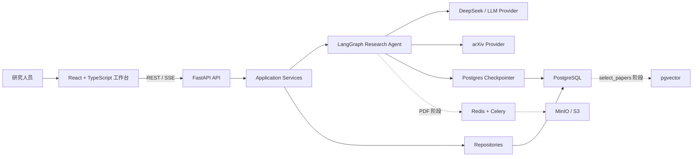

# 科研证据检索 Agent 项目建设指南

## 1. 项目定位

### 1.1 推荐名称

中文名称：

> 基于 LangGraph 的科研证据检索与结论生成 Agent

英文名称可从以下选项中选择：

- Research Evidence Agent
- Academic Evidence Agent
- Research Question Agent

### 1.2 一句话介绍

> 面向 AI/计算机方向研究生和科研人员，将宽泛研究主题转化为可检索的具体问题，从 Arxiv 论文全文中提取可追溯证据，并生成范围明确、带原文依据的研究结论。

当前通用 Agentic Search Demo 作为底层技术基座保留，负责 LangGraph 编排、查询规划、检索、证据状态、引用校验和流式事件。后续能力真正落地后，可以扩展为：

> 基于多源学术检索与证据约束推理的科研智能 Agent，支持证据综述、科研动态追踪和基于证据缺口的研究机会发现。

不要在功能尚未实现时提前使用后一种完整表述。

### 1.3 项目要解决的问题

普通学术搜索或论文问答通常只返回论文列表或摘要总结，容易出现以下问题：

- 复杂问题没有被拆分，搜索覆盖不完整；
- 宽泛研究主题没有被收敛为真正可回答的问题；
- 论文数量很多，但缺少能够直接支持结论的原文证据；
- 证据不足时仍然强行回答；
- 答案引用可能与真实来源不一致；
- 长任务缺少过程状态、失败恢复和质量评测。

本项目的核心不是“再做一个论文聊天机器人”，而是构建一个以研究问题和论文证据为中心、能够协助用户缩小问题范围并生成可验证结论的 Agent 系统。

## 2. 与 GPT Researcher 的关系

本项目受 GPT Researcher 的研究流程启发，但不是给原项目简单增加一层 API。

GPT Researcher 提供的基础包括：

- 查询规划和多子查询研究；
- Tavily、Bing、Google、Arxiv 等检索器；
- 网页抓取与正文处理；
- 上下文压缩和来源筛选；
- 报告生成；
- MCP 客户端和工具选择；
- FastAPI、WebSocket 和评测代码。

本项目重点进行以下重新设计：

- 将命令式搜索主流程改造成显式 LangGraph 状态图；
- 使用结构化 Graph State 管理每轮搜索、证据和引用；
- 增加证据充分性判断与查询改写循环；
- 通过 Provider 接口解耦搜索源和答案生成器；
- 将运行过程转换为可观测的 SSE 事件；
- 逐步补充持久化、工具治理、评测和生产级 API 能力。

对外介绍时，应说明“参考并复用了开源项目中的部分思路或组件”，同时清楚讲出自己重新设计的架构和新增闭环。

## 3. 当前版本基线

当前 demo 已形成以下工作流：

```text
analyze_query
    ↓
plan_queries
    ↓
search_sources（对子查询并行检索）
    ↓
grade_evidence
    ├─ 证据不足且仍有预算 → rewrite_query → search_sources
    └─ 证据充分或预算耗尽 → generate_answer
                                      ↓
                              verify_citations
                                ├─ 通过 → END
                                └─ 失败 → repair_answer → END
```

### 3.1 已实现能力

- `quick`、`standard`、`deep` 和自动模式选择；
- 结构化 LangGraph State；
- 多个子查询的异步并行搜索；
- 搜索来源去重与排序；
- 基于来源数量、相关性和查询覆盖率的证据充足度判断；
- 证据不足时改写查询并补充搜索；
- `max_iterations` 搜索预算，防止无休止循环；
- 结构化来源和引用；
- 引用 URL、source ID 和原文 quote 一致性校验；
- 错误引用过滤和基础答案修复；
- FastAPI JSON 接口、SSE 进度接口和健康检查；
- React + TypeScript + Vite 科研工作台，可输入问题、选择子问题、观察节点进度并查看论文；
- DeepSeek 生成 arXiv 检索式，并记录输入、输出、缓存和推理 Token；
- 真实 arXiv 元数据检索、跨检索式去重和部分失败保留；
- 宽泛问题通过 LangGraph `interrupt/resume` 暂停并恢复同一线程；
- 无需 API Key 的离线搜索与回答 Provider；
- Provider 协议已与父项目解耦，可分别注入问题规划、论文检索和模型适配；
- `MemorySaver` 和 `thread_id` 检查点基础；
- 图流程、循环预算、伪造引用和 API 的自动化测试。

### 3.2 当前能力边界

以下能力尚未完整实现，不能作为当前成果直接宣称：

- 当前 React 前端仍使用进程内任务状态和 POST-SSE，刷新页面后不能恢复运行历史；
- 通用搜索基线仍以 Demo Provider 为主，真实能力目前集中在科研问题规划、DeepSeek 和 arXiv 链路；
- 尚未抓取搜索结果对应网页的完整正文；
- 证据评分是启发式规则，不是语义事实核验；
- 引用校验能防止伪造 URL，但不能证明引用支持答案中的每项结论；
- `MemorySaver` 已支持当前进程内的中断恢复，但服务重启后线程丢失，也没有历史任务查询；
- SSE 当前主要推送节点进度，不是 LLM Token 流；
- 尚未接入 MCP ToolNode、Dify、Postgres Checkpointer 和自动化评测平台；
- 尚未具备完整的鉴权、限流、任务取消、超时重试和监控告警。

## 4. 目标架构

长期目标工作流如下：

```text
START
  ↓
analyze_query
  ↓
estimate_complexity
  ├─ 简单问题 → quick_search
  └─ 复杂问题 → plan_sub_queries
                    ↓
               route_tools
       ┌────────────┼────────────┐
   web_search  academic_search  mcp_tools
       └────────────┼────────────┘
                    ↓
              fetch_content
                    ↓
              grade_sources
                    ↓
            aggregate_evidence
                    ↓
             check_sufficiency
              ├─ 不充分 → rewrite_query → 再搜索
              └─ 充分或预算耗尽
                    ↓
              generate_answer
                    ↓
               extract_claims
                    ↓
              verify_citations
              ├─ 不通过 → 补搜或重新生成
              └─ 通过
                    ↓
              persist_session
                    ↓
                   END
```

LangGraph 在本项目中必须解决真实的控制流问题，而不仅仅是包装函数：

- 条件分支；
- 并行检索；
- 多轮循环；
- 动态工具调用；
- 中断与恢复；
- 状态持久化；
- 超时、失败和降级。

## 5. 核心设计原则

### 5.1 证据优先

答案生成只能使用当前 State 中经过治理的证据。每条关键结论应能追溯到具体来源和原文片段。

建议逐步将来源模型升级为：

```python
class Evidence:
    id: str
    title: str
    url: str
    content: str
    published_at: datetime | None
    source_type: str
    query: str
    relevance_score: float
    authority_score: float
    freshness_score: float
    information_density: float
    duplicate_group: str | None
    supported_claims: list[str]
```

### 5.2 Provider 与 Graph 解耦

Graph 只依赖稳定协议，不直接绑定某个搜索引擎或模型 SDK。

建议保留并扩展：

- `SearchProvider`：返回统一格式的候选来源；
- `ContentFetcher`：获取并清洗网页正文；
- `Reranker`：计算相关性和来源质量；
- `AnswerGenerator`：基于证据生成答案；
- `CitationVerifier`：校验 claim、quote 和 source 的对应关系；
- `Checkpointer`：管理任务状态持久化。

### 5.3 搜索必须有预算

每个任务至少要限制：

- 最大搜索轮数；
- 每轮最大子查询数；
- 每个查询最大结果数；
- 最大网页抓取数；
- 最大 Token 消耗；
- 最大费用；
- 最长执行时间。

预算耗尽时，应基于已有证据给出受限回答，并明确说明证据缺口，而不是无限搜索或静默失败。

### 5.4 工具选择应动态但受控

不同问题适合不同信息源：

| 问题类型 | 优先工具 |
|---|---|
| 新闻、时事 | Tavily、Google 或新闻搜索 |
| 论文、技术研究 | Arxiv、Semantic Scholar |
| 代码和版本变化 | GitHub MCP |
| 通用资料 | Bing、DuckDuckGo |
| 内部业务数据 | SQL/API MCP |

不应默认同时调用所有工具。路由节点负责选择工具，Tool Registry 负责权限和执行治理。

### 5.5 当前状态与长期愿景分开维护

README 主要回答“现在如何运行和使用”；本指南负责记录架构方向和建设路线。每完成一个阶段，再把对应能力从“规划”迁移到 README 的“已实现”。

## 6. 搜索模式

### quick

适用于事实明确、范围较小的问题：

```text
原始问题 → 单次搜索 → 来源筛选 → 带引用回答
```

目标是低延迟和低成本。

### standard

适用于需要多个角度的信息整合：

```text
生成 2～3 个子查询 → 并行检索 → 证据评估 → 综合回答
```

目标是在覆盖率、延迟和成本之间取得平衡。

### deep

适用于复杂研究、技术对比和时效性追踪：

```text
研究计划 → 多源并行搜索 → 网页抓取 → 证据治理
→ 缺口分析 → 多轮补搜 → 事实与引用校验 → 研究报告
```

目标是覆盖完整、来源可靠和过程可追溯。

## 7. 重点能力建设

### 7.1 网页正文抓取

这是当前最优先的能力。搜索摘要只能作为候选线索，最终证据应尽量来自实际网页正文。

实现要求：

- URL 规范化和去重；
- 并发抓取和域名级限速；
- 超时、重试和降级；
- HTML 正文抽取；
- PDF 和特殊页面处理；
- 空页面、登录页和反爬页面识别；
- 正文长度与信息密度检查；
- 保存抓取时间和内容哈希。

### 7.2 来源质量评估

来源评分至少应覆盖：

- Query Relevance：是否与问题相关；
- Authority：来源是否权威；
- Freshness：信息是否满足时间要求；
- Information Density：正文中有效信息占比；
- Duplication：是否与其他来源重复；
- Citation Support：能否支持具体结论。

不同 Provider 的原始 score 不能直接横向比较，应在系统内统一归一化或重新评分。

### 7.3 证据不足后的反思搜索

补搜不应只是给原查询机械添加后缀，而应先产生结构化缺口：

```json
{
  "missing_facts": ["性能对比数据"],
  "missing_perspectives": ["生产环境限制"],
  "conflicts": ["两个来源对版本支持范围描述不一致"],
  "suggested_queries": ["..."]
}
```

然后根据缺口生成补充查询，并避免重复搜索已经执行过的等价查询。

### 7.4 Claim 级引用校验

目标引用结构：

```json
{
  "claim": "LangGraph 支持持久化 checkpoint",
  "source_id": "source_3",
  "url": "https://...",
  "quote": "...",
  "support_score": 0.93
}
```

验证节点需要逐步检查：

- URL 是否来自真实检索结果；
- quote 是否存在于抓取正文；
- quote 是否支持对应 claim；
- 数字、日期和版本信息是否有来源；
- 是否存在无引用的关键事实；
- 多个来源是否互相冲突。

### 7.5 可观测性

每个节点应记录：

- 开始和结束时间；
- 输入、输出摘要；
- 执行状态；
- 搜索/工具调用次数；
- Token 和费用；
- 异常与重试次数；
- 状态变化；
- `request_id`、`thread_id` 和 trace ID。

建议的流式事件：

- `node_started`
- `node_completed`
- `tool_called`
- `source_found`
- `evidence_graded`
- `answer_delta`
- `result`
- `error`

## 8. MCP 与 Dify 的位置

### 8.1 MCP 是统一工具系统的一部分

建议目标结构：

```text
ToolRegistry
├── WebSearchTool
├── ArxivSearchTool
├── GitHubMCPTool
├── FilesystemMCPTool
├── DatabaseMCPTool
├── CalculatorTool
└── DifyWorkflowTool
```

工具系统需要具备：

- 动态加载工具描述；
- 工具权限白名单；
- 参数 Schema 校验；
- 超时和重试；
- 并行调用；
- 结果缓存；
- 审计日志；
- 失败自动降级。

第一版 MCP 只需打通 Tavily Web Search 与 GitHub MCP，形成“官方文档 + GitHub 源码/PR/Release”的跨源研究案例。

### 8.2 Dify 是可插拔外部工作流

项目核心编排仍由 LangGraph 负责。Dify 可以作为一种外部工具，用于特定领域的格式化或业务流程：

```text
LangGraph 搜索并收集证据
→ 调用 Dify 行业报告工作流
→ 获取结构化报告
→ LangGraph 再执行引用校验
```

不要让 Dify 与 LangGraph 同时承担主编排职责，否则项目边界会变得模糊。

## 9. 分阶段开发路线

### 阶段一：稳定当前 LangGraph 搜索闭环

目标：让已有 demo 成为一个真正独立、可部署的搜索服务。

任务：

- 去掉 Legacy Provider 对父项目代码的运行时依赖；
- 独立实现至少一个真实 Web Search Provider；
- 独立实现真实 LLM Answer Provider；
- 补充统一异常模型、配置校验、超时和重试；
- 完善节点事件和日志；
- 增加 Docker 与 CI；
- 将项目拆分为独立 Git 仓库。

验收标准：

- 新环境按照 README 可以一次启动；
- 离线和真实模式测试都能通过；
- 任一子查询失败不会导致整个任务无响应；
- 所有任务都有 request ID、轨迹和明确终态。

### 阶段二：网页正文与证据治理

目标：从“搜索摘要聚合”升级为“正文级证据研究”。

任务：

- 增加 `fetch_content` 节点；
- 增加正文清洗、去重和质量判断；
- 引入 rerank；
- 建立来源权威性、时效性和重复度评分；
- 将补搜逻辑改为结构化证据缺口驱动；
- 增加 Claim 级引用验证。

验收标准：

- 最终引用的 quote 来自实际抓取正文；
- 重复页面不会重复进入上下文；
- 关键结论能够映射到具体证据；
- 证据不足时能说明缺少什么并进行定向补搜。

### 阶段三：工具、持久化与多轮研究

目标：形成可恢复、可扩展的 Agent 应用。

任务：

- 实现 Tool Registry；
- 接入 GitHub MCP；
- 增加工具选择节点和权限白名单；
- 使用 Postgres Checkpointer；
- 增加任务历史、恢复、取消和继续追问接口；
- 支持基于已有研究结果进行后续问题研究。

验收标准：

- 服务重启后可以继续未完成任务；
- 用户能查询任务状态和执行历史；
- 工具调用可追踪、可限权、可超时；
- 同一线程的追问能复用已有证据而不重复完成全部搜索。

### 阶段四：前端工程化、Dify 与自动化评测

目标：形成适合展示、评估和持续优化的完整项目。

任务：

- 将现有可视化原型迁移为 React + TypeScript + Vite 前端；
- 展示研究计划、搜索来源、补搜原因、节点轨迹和最终引用；
- 接入 Dify Workflow Tool；
- 建立 Search Agent 测试集；
- 实现离线评测与回归比较；
- 接入 LangSmith 或自建 Trace 页面。

验收标准：

- 可以从页面完整发起并观察一次研究任务；
- 每次架构或 Prompt 变更都有评测结果对比；
- 能展示质量、延迟、调用次数和成本的优化数据。

## 10. 评测体系

测试集建议包含：

```text
question
expected_answer
expected_sources
required_facts
question_type
time_range
difficulty
```

### 检索质量

- Recall@K
- MRR
- 来源覆盖率
- 权威来源命中率
- 重复来源比例

### 答案质量

- Answer Relevancy
- Correctness
- Completeness
- Faithfulness

### 引用质量

- Citation Precision
- Citation Recall
- 引用支持率
- 无来源事实比例

### 工程指标

- P50/P95 总延迟
- 首事件和首 Token 时间
- 搜索调用次数
- 网页抓取成功率
- MCP 调用成功率
- 平均 Token 消耗
- 单问题平均成本
- 搜索循环终止率

Ragas 或 LLM Judge 可以用于 Faithfulness、Answer Relevancy 等语义指标；检索覆盖、引用一致性、延迟和成本应尽量使用可重复的确定性计算。

## 11. 首个完整演示案例

推荐演示问题：

> 分析 LangGraph 最近版本的 checkpoint 机制，并结合官方文档、GitHub 源码和版本变更说明其主要变化、适用场景与限制。

理想执行过程：

```text
正在分析问题……
已识别为深度技术研究任务
生成了 4 个研究子问题
正在检索官方文档……
正在通过 GitHub MCP 检索源码、PR 和 Release……
检索到 23 个候选来源
抓取并筛选出 8 个高质量来源
发现“版本兼容性”证据不足
正在进行定向补充搜索……
正在生成答案并抽取关键结论……
正在验证引用……
研究完成
```

该案例可以同时展示：

- 问题复杂度判断；
- 查询规划；
- 多源动态路由；
- 并行工具调用；
- 正文抓取；
- 证据缺口与反思搜索；
- 引用验证；
- SSE 执行轨迹。

## 12. 简历与面试表达

### 12.1 当前版本可使用的描述

> 基于 FastAPI 与 LangGraph 构建 Agentic Search 原型，将查询分析、子查询规划、并行检索、证据评估、反思式补充搜索、答案生成和引用校验建模为可观测状态图；通过 Provider 抽象实现离线测试与搜索/模型适配，并使用搜索预算防止无效循环。

### 12.2 后续功能完成后的量化描述模板

> 设计多源动态路由和正文级证据治理机制，接入 Web Search 与 GitHub MCP；基于 Postgres Checkpointer 实现长任务恢复和多轮研究，并建立覆盖检索、答案、引用、延迟与成本的自动化评测体系。优化后 Citation Precision 从 X 提升至 Y，P95 延迟降低 Z%。

其中 X、Y、Z 必须来自真实评测，不能预估或编造。

### 12.3 面试讲解主线

1. 原流程的问题：命令式编排、证据不足仍回答、来源与结论缺少强关联。
2. 为什么选择 LangGraph：需要分支、循环、并行、恢复和持久化，而不是因为框架流行。
3. 如何设计 State：保存查询计划、搜索轮次、来源、证据缺口、引用和 Trace。
4. 如何控制 Agent：轮数、时间、Token、费用和工具权限预算。
5. 如何保证质量：正文抓取、来源评分、Claim 级引用和回归评测。
6. 如何证明改进：用 Citation Precision、来源覆盖率、P95 延迟和成本数据说明。

## 13. 不应走偏的方向

- 不要过早扩展成泛化的“万能 Agent 平台”；
- 不要优先增加知识库 RAG，当前主线应是开放网络搜索和证据研究；
- 不要为了使用 MCP 而无差别接入大量工具；
- 不要让 Dify 和 LangGraph 同时控制主工作流；
- 不要只展示最终答案，应展示规划、证据和补搜原因；
- 不要把搜索结果数量当成证据质量；
- 不要把 URL 一致性校验描述成完整事实核验；
- 不要把 `MemorySaver` 描述成已经实现生产级任务恢复；
- 不要在没有评测数据时声称准确率、性能或成本显著提升。

## 14. 当前下一步

按价值和依赖关系排序，推荐依次完成：

1. 将真实 Search/LLM Provider 从父项目中独立出来；
2. 增加网页正文抓取节点和抓取质量判断；
3. 重构 Evidence 模型与来源评分；
4. 将补搜改为结构化证据缺口驱动；
5. 实现 Claim 级引用验证；
6. 接入 GitHub MCP 和 Tool Registry；
7. 使用 Postgres Checkpointer 实现任务恢复；
8. 增加可视化前端和自动化评测。

每一步都应同步补充测试、Trace 和可量化指标，确保项目从可运行 Demo 持续演进为能够解释设计取舍、验证效果并独立部署的 Agent 应用。

## 15. 产品主方案：科研证据与研究机会 Agent

### 15.1 方向定位

科研方向现已确定为产品主方案，通用 Agentic Search 转为底层技术基座。长期定位为：

> 基于多源学术检索与证据约束推理的科研智能 Agent，围绕研究问题构建 Claim-Evidence 图谱，聚合支持与反对证据，持续追踪领域结论变化，并从证据冲突和研究空白中生成可验证的研究机会。

产品不以“搜索和总结论文”为最终目标，而是以研究问题和科学结论为中心，主要覆盖三个相互衔接的场景：

```text
文献证据综述
→ 建立当前领域的共识、争议和证据边界

科研动态追踪
→ 判断新论文如何支持、削弱或修正已有结论

科研选题与机会发现
→ 从证据薄弱点、冲突和未覆盖场景中提出可验证假设
```

推荐建设顺序是“证据综述 → 动态追踪 → 研究机会生成”。创新建议必须建立在可追溯证据上，不能退化成脱离文献覆盖范围的自由脑暴。

### 15.2 核心对象：Claim-Evidence 图谱

系统不只保存论文列表，而应抽取并维护以下关系：

```text
Research Question
├── Claim
│   ├── Supporting Evidence
│   ├── Opposing Evidence
│   ├── Applicable Conditions
│   ├── Dataset / Method / Metric
│   ├── Contradictions
│   └── Confidence / Uncertainty
├── Research Gap
└── Candidate Opportunity
```

同一结论在不同论文中可能使用不同术语、数据集和实验条件。系统需要先完成 Claim 归一化和实验条件对齐，再判断论文之间是真正冲突，还是研究对象、评价指标或适用条件不同。

### 15.3 搜索 Agent 与推理 Agent 的分工

搜索 Agent 负责证据边界：

- 拆分研究问题并设计学术检索式；
- 检索论文、引用关系、数据集和后续研究；
- 围绕缺失证据和争议结论进行定向补搜；
- 记录检索范围、纳入排除条件和时间快照；
- 控制搜索轮次、来源数量、Token、费用和任务时间。

推理 Agent 或强模型负责证据理解：

- 提取论文中的 Claim、方法、数据集、指标和局限；
- 聚合语义相同或相近的 Claim；
- 对齐不同实验的适用条件；
- 识别支持、反对、部分支持和无法比较的关系；
- 总结共识、争议和不确定性；
- 从证据缺口中生成候选研究问题和可验证假设。

二者之间通过结构化 State 和 Claim-Evidence 数据交换，避免将大量论文直接拼接后交给一次大模型调用。

### 15.4 多 Agent 设计候选（后续方案，MVP 不实现）

多 Agent 主要用于并行分析、视角分离和交叉验证。建议优先考虑以下职责，而不是设置只有名称不同、工作内容相同的角色。

#### 证据聚合阶段

- `ClaimExtractorAgent`：逐篇提取可验证结论及论文原文位置；
- `MethodologyAgent`：提取实验对象、方法、数据集、指标和统计条件；
- `EvidenceClusterAgent`：对语义相近的 Claim 聚类并形成候选共识；
- `CoverageAgent`：检查重要研究分支、反对证据和代表性论文是否遗漏。

这些 Agent 可以按论文、主题或证据类型并行执行，再由聚合节点合并和去重。

#### 冲突分析阶段

- `SupportAnalystAgent`：寻找并总结支持当前 Claim 的最强证据；
- `SkepticAgent`：主动寻找反例、负结果、复现失败和方法缺陷；
- `ConditionAnalystAgent`：判断冲突是否来自数据集、人群、实验条件、时间或指标差异；
- `AdjudicatorAgent`：基于双方证据给出“支持、反对、条件性成立、证据不足或不可比较”的裁决，并标注不确定性。

该阶段适合使用更强模型作为裁决 Agent，但裁决输出必须引用结构化证据，不能仅凭模型内部知识判断。

#### 研究机会生成阶段

- `GapAgent`：从缺失验证、薄弱证据和长期未解决问题中生成机会；
- `ContradictionAgent`：从无法解释的冲突结果中生成研究问题；
- `CrossDomainAgent`：寻找不同研究分支之间可能建立的新连接；
- `FeasibilityAgent`：从数据、算力、实验周期和可测量性评估可行性；
- `NoveltyVerifierAgent`：针对候选选题执行反向检索，检查是否已有相同或高度相似研究；
- `OpportunityReviewerAgent`：合并不同视角，形成带依据的候选机会排序。

多个 Agent 可以分别生成不同类型的总结和研究机会，但最终结果不应采用简单多数投票。更合理的方式是保留每个 Agent 的依据、反对意见和置信度，再由 Reviewer 依据明确标准进行合并。

### 15.5 候选 LangGraph 工作流

```text
START
  ↓
analyze_research_question
  ↓
plan_academic_search
  ↓
parallel_retrieve_papers
  ↓
parallel_extract_claims
  ↓
normalize_and_cluster_claims
  ↓
aggregate_evidence
  ↓
multi_agent_conflict_analysis
  ├── 证据不足 → generate_gap_queries → 补充检索
  └── 证据达到当前预算上限
  ↓
build_claim_evidence_graph
  ↓
parallel_generate_opportunities
  ↓
verify_novelty_and_feasibility
  ↓
review_and_rank_opportunities
  ↓
verify_citations_and_scope
  ↓
persist_research_snapshot
  ↓
END
```

其中 `parallel_extract_claims`、`multi_agent_conflict_analysis` 和 `parallel_generate_opportunities` 可以使用 LangGraph `Send` 或子图实现并行；裁决、补搜和创新性复核使用条件边和循环。

### 15.6 研究机会输出形式

系统不承诺自动发现“真正创新”的选题，而是输出有证据支撑的候选研究机会：

```text
研究问题
发现依据
对应证据缺口或冲突
候选假设
建议实验或验证方法
预期贡献
已有相似研究
创新性风险
数据与资源可得性
可行性判断
支持与反对证据
不确定性
```

科研人员负责最终判断研究价值。系统的价值是缩小探索空间、暴露证据边界，并把选题建议变成可验证而非纯概念性的假设。

### 15.7 质量控制与评测

该方向对基础模型能力依赖较高，因此必须通过流程和评测降低模型更换带来的不稳定性：

- 对 Claim 提取、证据关系和实验条件进行结构化输出校验；
- 为支持、反对和冲突判断保留原文引用；
- 将“没有检索到证据”与“该研究不存在”严格区分；
- 对候选创新点执行独立反向检索；
- 记录每次综述的检索日期、来源范围和纳入排除条件；
- 使用人工标注样本评测 Claim Extraction、Evidence Relation、Conflict Classification 和 Gap Precision；
- 比较单强模型、多 Agent 和“弱模型并行 + 强模型裁决”的质量、延迟与成本；
- 明确展示不确定性和需要领域专家确认的部分。

### 15.8 长期实施边界

该方向已替换原通用搜索产品主线，但长期能力仍需分阶段实现。后续可选择范围明确的计算机科学或 AI 子领域，逐步完成以下闭环：

```text
输入一个具体研究问题
→ 检索代表性论文
→ 构建 Claim-Evidence 矩阵
→ 分析一项明确争议
→ 追踪新增论文带来的结论变化
→ 生成少量带证据、可验证的研究机会
```

第一阶段不追求覆盖全部学科，也不宣称替代系统综述专家或自动完成学术创新。

### 15.9 已确定的第一版 MVP

#### 目标用户

- AI/计算机方向研究生；
- 需要进入新研究主题或验证技术判断的科研人员；
- 第一版不覆盖医学、法律等对专业数据库和领域规范要求更高的学科。

#### 核心任务

> 用户输入一个研究问题；系统在必要时帮助用户将其收敛为具体子问题，经用户确认后，从 Arxiv 论文全文中提取证据并生成研究结论。

第一版只解决“问题收敛、学术检索、全文证据提取、结论生成和引用校验”，不生成完整文献综述。

#### 输入与问题收敛

系统同时接受具体问题和宽泛主题：

```text
具体问题
→ 直接进入学术检索

宽泛问题
→ 拆解为 3～5 个可检索、尽量互不重复的子问题
→ 为每个子问题提供简短范围说明
→ 暂停工作流并等待用户选择
→ 用户选择或修改一个子问题
→ 恢复同一研究线程并进入检索
```

第一版一次只研究一个用户最终确认的问题，不支持同时选择多个研究分支。该交互使用 LangGraph Checkpointer、`thread_id` 和 Human-in-the-loop `interrupt/resume` 表达，使状态保存具备真实产品用途。

#### 数据源与证据范围

第一版只接入 Arxiv，包括：

- Arxiv 搜索和论文元数据；
- 标题、作者、摘要、发布时间和版本；
- Arxiv 页面与 PDF 链接；
- PDF 全文下载、解析和段落定位。

仅使用摘要时，结果只能称为摘要级初步分析。正式证据应尽量来自 PDF 全文，并保存章节、页码或可复核的文本位置。输出必须声明：当前结论仅基于本次检索到的 Arxiv 论文，不代表全部学术证据。

#### 输出

第一版只向用户交付“结论”和“证据”两个主要区域。

结论至少包含：

```text
answer       直接回答用户最终确认的问题
basis        本次结论使用的论文和证据范围
limitations  数据源、实验条件和可推广范围限制
```

每条证据至少包含：

```text
statement     由论文支持的证据陈述
relation      证据与当前结论的最小关系标签
paper         标题、作者、时间、Arxiv ID 和 URL
quote         论文原文片段
location      章节、页码或正文位置
```

不输出共识比例、争议专题、研究趋势、选题建议、完整综述或复杂可视化。

#### 最小证据关系与冲突标准

MVP 不实现独立的共识或争议分析模块，但不能为了生成明确结论而忽略反向证据。内部保留四类最小关系：

| 关系 | 判断标准 |
|---|---|
| `supports` | 论文结果在相符研究条件下直接支持当前结论 |
| `qualifies` | 论文表明结论只在特定模型、数据集、指标或实验条件下成立 |
| `contradicts` | 在具有可比性的研究条件下，论文结果与当前结论直接不一致 |
| `not_comparable` | 研究对象、数据集、方法或指标差异过大，不能直接比较 |

这些关系不用于生成复杂“争议报告”，而用于约束结论措辞：存在限制证据时说明成立条件；存在直接冲突时不得生成无条件确定结论；证据不可比较或数量不足时明确说明无法得出强结论。

#### 单 Agent 职责与 LangGraph 节点

MVP 不使用多 Agent。系统使用一个研究 Agent，由 LangGraph 将职责拆成可观测节点：

```text
analyze_question
  判断问题是否足够具体，提取研究对象、场景和比较维度

generate_subquestions
  将宽泛问题拆成 3～5 个可检索子问题，不提前生成答案

wait_for_user_selection
  暂停工作流，接收用户选择或修改后的最终问题

build_search_queries
  生成适合 Arxiv 的英文关键词、同义词、缩写和检索式

search_arxiv
  检索候选论文，保存元数据、版本并去重

select_papers
  评估相关性，过滤明显无关论文并限制全文解析数量

fetch_and_parse_papers
  下载 PDF、提取正文并保留引用位置，记录解析失败

extract_evidence
  提取与研究问题直接相关的原文证据并标注最小关系

generate_conclusion
  只基于已提取证据回答，证据不足时降低结论强度或拒绝强结论

verify_output
  校验论文、URL、quote、location 以及结论中的关键事实是否可追溯
```

对应的第一版主流程为：

```text
START
  ↓
analyze_question
  ├─ 问题具体 ─────────────────────┐
  └─ 问题宽泛                     │
        ↓                          │
generate_subquestions              │
        ↓                          │
wait_for_user_selection            │
        ↓                          │
用户选择或修改问题 ────────────────┘
        ↓
build_search_queries
        ↓
search_arxiv
        ↓
select_papers
        ↓
fetch_and_parse_papers
        ↓
extract_evidence
        ↓
generate_conclusion
        ↓
verify_output
        ↓
END
```

当前实现进度（2026-07-15）：已完成到 `build_search_queries` 和 arXiv 论文元数据检索，并实现跨检索式去重、匹配检索式合并及部分查询失败保留。React 工作台通过 SSE 显示节点运行状态、宽泛问题选择、检索式、论文结果及 LLM token/缓存 usage；Vite 生产构建由 FastAPI 直接托管。接口状态以 `papers_ready` 或 `no_results` 结束。`select_papers` 及其后的 PDF 全文证据链路尚未实现，因此当前输出只能视为摘要级候选论文集。

#### 第一版明确不实现

- 多 Agent 证据辩论和强模型裁决；
- 领域共识计算与独立争议分析；
- 科研动态订阅与持续追踪；
- 科研选题、创新点和研究机会生成；
- Semantic Scholar、Crossref、GitHub 等其他来源；
- 引用网络和 Claim-Evidence 图谱可视化；
- 自动实验设计、论文复现或代码执行；
- 完整系统综述和学术写作代写。

上述能力保留为长期方案，只有在 Arxiv 全文证据提取和结论可追溯性经过评测后再逐步引入。

## 16. 已确定的产品技术架构

本节记录 2026-07-15 确定的目标技术架构。React 前端工程化已经完成，后续按本架构推进 PostgreSQL 持久化和 PDF 证据链路建设。新增组件必须解决已经出现的产品问题，不能为了丰富简历而无条件堆叠中间件。

### 16.1 技术选型总表

| 层级 | 目标技术 | 引入阶段 | 决策说明 |
|---|---|---|---|
| Web 前端 | React + TypeScript + Vite | 已实现 | 科研工作台是 SPA，不需要 Next.js 的 SSR 和第二套服务端路由 |
| 前端状态 | React `useReducer` + 自定义 Hooks | 已实现 | 服务端工作流是事实来源，第一版不引入 Redux 或 Zustand |
| 前端样式 | 复用现有设计变量和组件 CSS | 已实现 | 保留现有视觉和响应式布局 |
| 后端 API | FastAPI + Pydantic | 已实现并长期保留 | 负责协议、校验、鉴权、SSE 适配和依赖装配 |
| Agent 编排 | LangGraph | 已实现并长期保留 | 负责条件分支、中断恢复、研究循环和节点状态 |
| 实时通信 | REST + SSE | 已实现并长期保留 | 研究过程以服务端事件为主，不需要 WebSocket 双向常连接 |
| 业务数据库 | PostgreSQL | React 迁移后 | 保存研究任务、检索式、论文、事件和模型调用 |
| 数据访问 | SQLAlchemy 2 + Alembic + psycopg 3 | PostgreSQL 阶段 | ORM、迁移和 LangGraph PostgreSQL 组件统一使用 psycopg 驱动 |
| Graph 持久化 | `langgraph-checkpoint-postgres` | PostgreSQL 阶段 | 替换只适用于单进程开发的 `MemorySaver` |
| 向量检索 | PostgreSQL + pgvector | `select_papers` 阶段 | 用于问题与论文摘要/段落的语义检索，不提前引入独立向量库 |
| 任务队列 | Redis + Celery | PDF 全文阶段 | 承担 PDF 下载、解析、向量化和失败重试等长任务 |
| 文件存储 | 开发环境本地目录，生产环境 MinIO/S3 | PDF 全文阶段 | PDF 和解析产物不写入 PostgreSQL 大字段 |
| 本地部署 | Docker Compose | PostgreSQL 阶段 | 固化前端、API、数据库及后续 Worker 的启动方式 |
| 可观测性 | 结构化日志 + OpenTelemetry 指标接口 | 持久化后 | 统一记录 run、thread、node、延迟、Token 和错误 |

React TypeScript 工程使用 Vite 官方 React 插件和开发服务器，参考 [Vite 官方指南](https://vite.dev/guide/)。LangGraph 生产状态使用官方 PostgreSQL Checkpointer，参考 [LangGraph Checkpointer 文档](https://docs.langchain.com/oss/python/langgraph/add-memory)。语义检索优先使用 [pgvector](https://github.com/pgvector/pgvector)，在同一数据库中保留关系数据、全文检索和向量检索能力。

### 16.2 目标组件关系



组件职责必须保持以下边界：

- React 只能访问 FastAPI，不直接访问 DeepSeek、arXiv、PostgreSQL 或 Redis；
- FastAPI 负责 HTTP/SSE 协议和用户动作，不在路由函数中实现研究逻辑；
- Application Service 负责业务用例、事务和 Graph 调用，是 API 与 LangGraph 之间的边界；
- LangGraph 负责研究过程控制，不承担产品历史查询和数据库报表职责；
- Provider 封装外部模型和数据源差异，节点不拼接供应商 URL 或解析供应商私有响应；
- Repository 管理业务表，禁止业务代码直接读取 LangGraph Checkpoint 内部表；
- Redis 只承担临时队列、缓存和事件分发，不能作为研究任务的最终事实来源。

### 16.3 前端目标设计

前端在仓库根目录使用独立 `frontend/` 工程，通过 Vite 构建 React SPA。开发环境使用 Vite 代理 `/api`、`/health`、`/docs` 和 `/openapi.json` 到 FastAPI 的 `8010` 端口；生产构建生成到 Python 包内的 `web/` 目录，单机演示继续由 FastAPI 托管，未来也可以改由 Nginx/CDN 托管。

首批组件边界确定为：

```text
ResearchInput
  输入问题、示例问题和启动操作

WorkflowTimeline
  显示节点 running/completed/waiting/skipped/error 状态

QuestionSelection
  处理宽泛问题的候选选择与自定义修改

UsagePanel
  汇总每次 LLM 调用的输入、输出、缓存、推理 Token 和模型信息

SearchPlanPanel
  展示关键词和 arXiv 检索式

PaperList
  展示候选论文、摘要、分类、匹配查询和链接

RunHistory（PostgreSQL 阶段）
  查询历史任务、恢复中断任务和查看失败原因
```

状态管理遵循以下规则：

- `run_id` 对应一次产品研究任务，`thread_id` 对应 LangGraph 执行线程；
- 服务端返回的任务状态是唯一事实来源，前端不能根据动画自行推断任务已完成；
- 表单、展开项和当前选择属于本地 UI 状态，第一版使用 `useReducer` 和自定义 Hooks；
- SSE 连接使用 `AbortController` 支持取消，断线后根据 `run_id` 重新读取任务状态；
- 前端不保存 API Key，所有模型密钥仅存在于 FastAPI 服务端环境变量；
- `frontend/src/` 是唯一的前端源码，`web/` 只保存 Vite 构建产物，不再维护第二套原生页面逻辑。

### 16.4 后端分层与目标 API

后端保持一个 FastAPI 服务，但代码按职责拆分：

```text
api
  HTTP 路由、请求响应模型、错误映射、SSE 输出

application
  创建任务、恢复任务、选择问题、取消任务和查询历史

research
  LangGraph State、节点、边和研究策略

providers
  DeepSeek、arXiv、PDF Parser、Embedding 和 Reranker 适配

repositories
  PostgreSQL 业务数据访问

infrastructure
  数据库连接、Checkpointer、Redis、对象存储和可观测性
```

当前 `POST /api/v1/research/stream` 把“创建任务”和“消费事件”放在一次连接中，适合本地原型。接入 PostgreSQL 后，目标 API 调整为：

```text
POST /api/v1/research/runs
  创建任务，返回 202、run_id 和 thread_id

GET /api/v1/research/runs/{run_id}
  返回任务当前状态、结果摘要和等待的用户动作

GET /api/v1/research/runs/{run_id}/events
  SSE 事件流，支持 Last-Event-ID 断线续传

POST /api/v1/research/runs/{run_id}/selection
  提交候选 option_id 或用户修改后的问题

POST /api/v1/research/runs/{run_id}/cancel
  请求取消尚未完成的任务

GET /api/v1/research/runs
  分页查询历史任务
```

持久化改造期间保留当前 POST-SSE 接口；引入运行历史 API 后再切换为可恢复的 GET 事件流。目标 SSE 事件使用统一外壳：

```json
{
  "event_id": "evt_...",
  "run_id": "run_...",
  "sequence": 12,
  "type": "node.running",
  "node": "build_search_queries",
  "message": "正在调用模型生成学术检索式",
  "timestamp": "2026-07-15T10:00:00Z",
  "details": {}
}
```

`sequence` 在同一 `run_id` 内单调递增，事件写入 PostgreSQL 后再向客户端推送。断线重连时，服务端根据 `Last-Event-ID` 或最后 sequence 补发事件，前端不得依赖只存在于进程内的事件队列。

### 16.5 PostgreSQL 数据职责

PostgreSQL 同时承载 LangGraph Checkpoint 与产品业务数据，但两者逻辑隔离：

- Checkpoint 表由 `langgraph-checkpoint-postgres` 管理，用于节点快照、中断和恢复；
- 业务表由 SQLAlchemy 和 Alembic 管理，用于产品展示、历史查询、统计和评测；
- 业务代码只通过 Repository 读取业务表，不依赖 Checkpoint 的内部表结构；
- `run_id` 与 `thread_id` 显式映射，不能假设两个 ID 永远相同；
- Checkpoint 成功不代表业务任务已完整落库，业务事件写入必须幂等。

第一批业务表确定为：

| 表 | 主要职责 |
|---|---|
| `research_runs` | 原问题、最终问题、状态、thread_id、配置、错误和时间 |
| `research_subquestions` | 候选子问题、范围说明、顺序和用户选择 |
| `workflow_events` | 节点事件、sequence、message、details 和时间 |
| `search_queries` | 每次任务生成的检索式、关键词、顺序和来源模型 |
| `papers` | 以 arXiv ID 唯一标识的论文元数据和摘要 |
| `run_papers` | 任务与论文关联、排名、匹配查询和筛选状态 |
| `llm_calls` | operation、provider、model、延迟、Token、缓存和调用状态 |

PDF 阶段再增加：

| 表 | 主要职责 |
|---|---|
| `paper_documents` | PDF 对象存储地址、版本、解析状态和校验值 |
| `paper_chunks` | 章节、页码、文本位置、内容和向量 |
| `evidence_items` | statement、quote、location、relation 和 paper/chunk 外键 |
| `conclusions` | answer、basis、limitations、版本和验证状态 |

结构化、需要筛选或关联的字段使用普通列；节点细节、Provider 原始扩展字段使用 JSONB。PDF 二进制、整篇解析文本和大型模型响应不直接写入业务主表。

### 16.6 pgvector 使用边界

pgvector 在 `select_papers` 和全文证据检索阶段启用，不参与当前 arXiv 元数据抓取。第一阶段向量对象为研究问题和论文摘要，后续扩展到论文段落。

目标检索采用混合策略：

```text
arXiv 关键词检索候选集
→ PostgreSQL 元数据过滤
→ pgvector 余弦相似度召回
→ 规则或 Reranker 重排
→ 限制进入 PDF 解析的论文数量
```

第一版使用精确向量检索，数据量和延迟证明有必要后再增加 HNSW。暂不引入 Milvus、Qdrant、Pinecone 或 Elasticsearch，避免重复维护关系数据与向量数据的一致性。

### 16.7 Redis、Celery 与对象存储边界

当前问题规划和 arXiv 检索继续在 FastAPI/LangGraph 异步流程中执行，不立即引入任务队列。出现以下任务后再启用 Redis + Celery：

- 并行下载多篇 PDF；
- PDF 解析、OCR 和失败重试；
- 文本分段、Embedding 和批量写入；
- 单次运行超过普通 HTTP/SSE 生命周期；
- 需要 Worker 横向扩展或任务优先级。

届时职责为：

```text
LangGraph
  决定需要执行什么、等待哪些结果以及下一条边

Celery Worker
  执行可重试的 PDF、解析、向量化和证据抽取子任务

Redis
  Celery Broker、短期缓存、分布式限流和事件通知

PostgreSQL
  任务、事件、元数据和最终状态的事实来源

MinIO / S3
  PDF、解析产物和大型中间文件
```

开发环境对象存储可以先使用受控本地目录；出现多 Worker 或远程部署时切换到 MinIO/S3。Redis 数据可以丢失并重建，PostgreSQL 和对象存储中的产品数据不能依赖 Redis 才能恢复。

### 16.8 部署与配置

PostgreSQL 阶段使用 Docker Compose 固化本地环境：

```text
frontend   React/Vite 开发服务或静态构建
api        FastAPI + LangGraph
postgres   业务数据 + Checkpoint + 后续 pgvector
```

PDF 阶段再增加：

```text
worker     Celery Worker
redis      Broker / Cache / Rate Limit
minio      S3-compatible PDF storage
```

生产环境中，React 静态文件由 Nginx/CDN 托管，FastAPI 和 Worker 使用独立容器，PostgreSQL、Redis 和对象存储优先使用托管服务。前端只接收公开运行配置；数据库密码、DeepSeek Key、对象存储凭据和内部 Provider 配置只注入后端。

环境变量按领域命名：

```text
APP_*          服务和环境
DATABASE_*     PostgreSQL
LANGGRAPH_*    Checkpointer
LLM_*          模型 Provider
ARXIV_*        arXiv Provider
REDIS_*        Redis
CELERY_*       Worker
STORAGE_*      本地或 S3 存储
OTEL_*         可观测性
```

### 16.9 可观测性与安全基线

所有日志、业务事件和模型调用至少包含：

```text
request_id
run_id
thread_id
node
provider
model
latency_ms
token_usage
status
error_type
```

日志不得记录 API Key、完整用户凭据和 PDF 临时访问签名。LLM usage 以供应商响应为准，按 operation 保存调用明细，再聚合为运行总量。Prompt 原文默认不写日志；如果后续为调试保存，必须支持脱敏和显式开关。

第一版安全要求包括：

- 前端永远不持有 DeepSeek Key；
- Provider 设置超时、有限重试和错误分类；
- arXiv 保留访问间隔，并在多实例后使用 Redis 分布式限流；
- PDF 下载限制大小、类型、重定向次数和允许协议；
- 所有用户输入通过 Pydantic 校验，数据库访问使用参数化查询；
- 任务取消是状态变更，Worker 在安全检查点响应取消，不直接强杀写入中的任务。

### 16.10 实施顺序与验收标准

#### A. React 前端工程化（已完成，2026-07-15）

- 创建 `frontend/` React + TypeScript + Vite 工程；
- 迁移当前输入、流程时间线、问题选择、Usage、检索式和论文列表；
- 封装 REST 客户端与 SSE Hook，使用 Vite Proxy 联调；
- 保持当前 API 和页面能力一致，删除原生页面逻辑，仅保留 Vite 构建产物。

验收结果：具体问题和宽泛问题继续使用原有 SSE 全流程；节点状态、论文和 Token 数据能力保持一致；前端 Vitest、TypeScript 检查、Vite 构建和 FastAPI 回归测试通过。

#### B. PostgreSQL 业务持久化

- 引入 SQLAlchemy、Alembic 和 psycopg；
- 建立第一批七张业务表与 Repository；
- 保存运行、事件、查询、论文和 LLM 调用；
- 增加历史任务和单任务查询 API。

验收：服务重启后能查看已完成任务；论文按 arXiv ID 去重；usage 可按任务聚合；迁移可在空库重复执行。

#### C. LangGraph 持久化与可恢复事件流

- 使用 Postgres Checkpointer 替换生产环境 `MemorySaver`；
- 分离 `run_id` 和 `thread_id`；
- 将 SSE 改为基于持久化 workflow event 的 GET 事件流；
- 支持断线续传、历史事件回放、取消和服务重启后恢复。

验收：宽泛问题在服务重启后仍可继续选择；SSE 断线重连不重复或遗漏事件；同一用户动作不会重复推进 Graph。

#### D. 论文筛选与全文基础设施

- 先实现摘要相关性筛选并启用 pgvector；
- 再引入 Redis、Celery 和对象存储；
- 完成 PDF 下载、解析、分段和失败重试；
- 最后接入证据提取与结论生成。

验收：只有高相关论文进入 PDF 解析；失败任务可安全重试；PDF 与解析版本可追踪；结论能映射到原文位置。

### 16.11 当前明确不引入

在出现可量化需求前，不引入以下组件：

- Next.js 或第二套服务端渲染层；
- Redux、Zustand 等全局前端状态库；
- WebSocket；
- Kubernetes；
- Kafka；
- Elasticsearch；
- 独立向量数据库；
- Redis/Celery 和 MinIO 的空壳部署；
- 微服务拆分。

本项目在第一版保持“React SPA + FastAPI 单体后端 + LangGraph + PostgreSQL”的模块化单体架构。只有当 PDF Worker、并发量或部署边界证明需要拆分时，才增加独立进程或基础设施。
